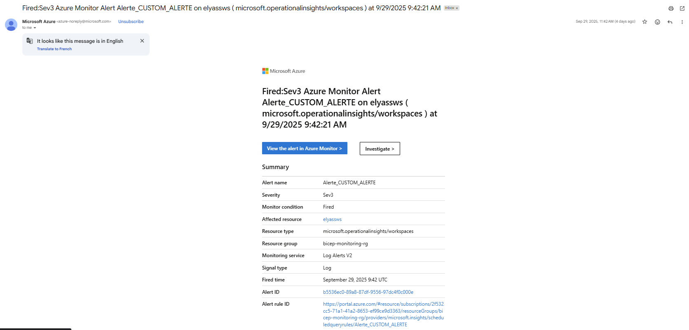

# File: README.md
```markdown
# Projet Azure Cloud Monitoring


Ce projet à pour but de déployer une infrastructure basé sur une VM linux, et d'assurer le monitoring/surveillance automatique (via un cron bash sur un script) en envoyant des alertes automatiques par mail lorsque des métriques semblent anormales (selon des critères que j'ai prédéfini) --

    Le fichier bicep (agissant comme Terraform) va déployer automatiquement, en se basant sur le fichier depploy.sh :
        - Une VM Ubuntu Linux (Standard_B1s)
        - Un Log Analytics Workspace (pour recevoir les logs)
    
    J'ai ensuite installé un AMA (Azure monitor agent) et mis en place une po^litique DCR (Data colletion rules) :
        - L'AMA est agent installé sur la VM linux qui va récolter les logs (echo, ...) et métriques (CPU, RAM,...) de la VM en suivant justement une politique de récolte DCR
            (dans mon script bash custom_monitor.sh , les alertes sont précédées de 'logger', elles sont donc stockées dans /var/log/syslog. C'est tout logiquement que j'ai configuré
            une DCR ne lisant que /var/log/syslog)

    Afin d'établir un monitoring pertinent et efficace, j'ai écrit un script bash déclenchant un logger contenant la mention '[CUSTOM_ALERT]' lorsque une ressource (ram, CPU, disk)
    dépasse un certain seuil

        - exemples tirés du script : 

                CPU=$(top -bn1 | grep "Cpu(s)" | awk '{print 100 - $8}') 
                CPU=$(printf "%.2f" "$CPU")                                                                 

                if (( $(echo "$CPU > 80" | bc -l) )); 
                then logger "[CUSTOM_ALERT] CPU HIGH: ${CPU}%" 
                fi

    A noter que j'ai également mis en place un cron sur ce script afin qu'il soit éxécuté toutes les 5 minutes :

            sudo crontab -e
            */5 * * * * /usr/local/bin/custom_monitor.sh


    J'ai ensuite mis en place une règle Azure Monitor Alert, qui envoi un mail dés lors qu'un log contenant la mention '[CUSTOM_ALERT]' apparaît dans le Log Analytics Workspace,
    par le biais de la requête KQL suivante : 

            Syslog 
            | where Computer == "elyassvm"                                # elyassvm étant le nom de ma VM
            | where SyslogMessage contains "[CUSTOM_ALERT]"               # je séléctionne seulement les logs contenant [CUSTOM_ALERT]
    
# Exemple d’alerte reçue
Voici un exemple d’alerte envoyée par mail lorsque la charge CPU dépasse le seuil défini :

